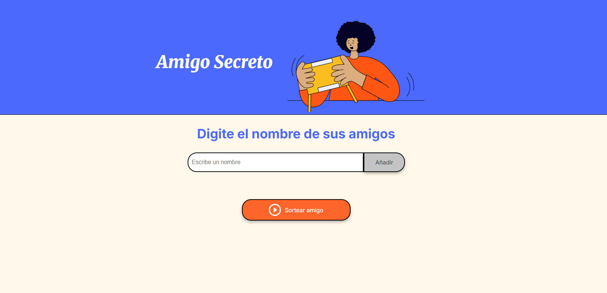
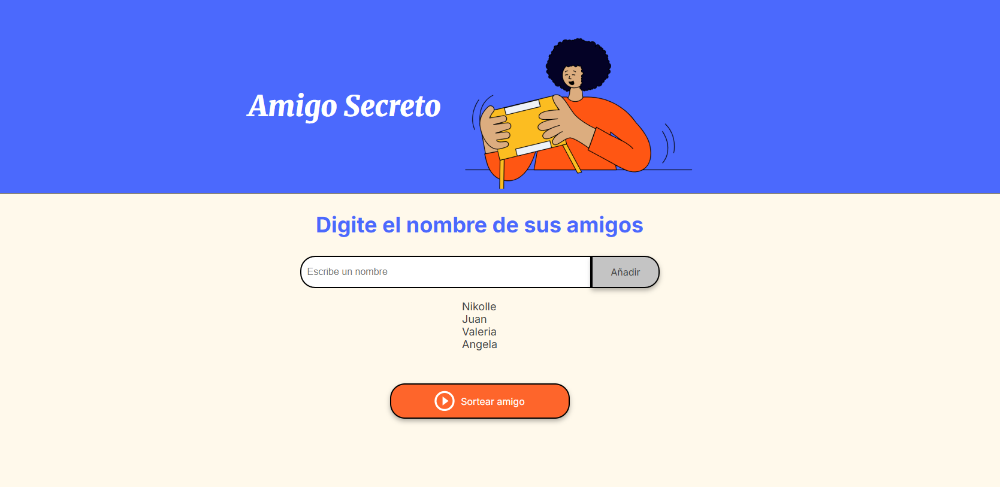
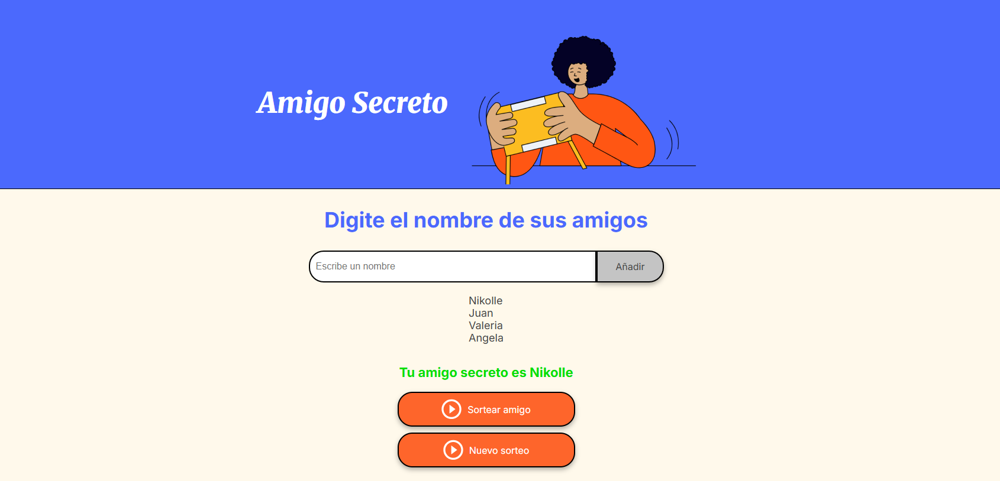

# 🎁 Amigo Secreto

Aplicación web para realizar el sorteo del juego *Amigo Secreto* de forma rápida y divertida.

## 📌 Descripción

Esta aplicación permite:
- Agregar nombres a una lista.
- Validar que el campo no esté vacío.
- Mostrar los nombres ingresados en pantalla.
- Realizar un sorteo aleatorio para elegir un amigo secreto.

## 🚀 Funcionalidades

1. **Ingreso de nombres:**  
   - Solo permite texto.
   - Muestra una alerta si el campo está vacío.

2. **Lista visible de participantes:**  
   - Cada nombre agregado aparece en pantalla.

3. **Sorteo aleatorio:**  
   - Escoge un nombre de forma aleatoria.
   - Muestra el resultado en pantalla.

## 🖼️ Capturas de pantalla

- Vista inicial

- Lista de nombres agregados

- Resultado del sorteo


## 🎥 Vista en acción


## 🛠️ Tecnologías usadas

- HTML5
- CSS3
- JavaScript
- Git & GitHub

## 📂 Cómo usar

1. Clona este repositorio:
   ```bash
   git clone https://github.com/NikolleRR/amigo-secreto.git
